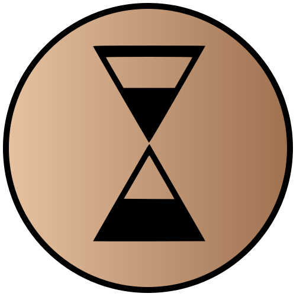

<p align="center"></p>

## Chronos

#### A desktop application that tracks screen time/idle time of used processes

<a href="https://www.producthunt.com/posts/chronos-9?utm_source=badge-featured&utm_medium=badge&utm_souce=badge-chronos-9" target="_blank"></a>

## Download

For now, application only available for the Windows yet I am planning to expand it to Linux/macOS. Contributions are welcome!

[Download for Windows](https://github.com/CeamKrier/Chronos/releases/download/win-v0.0.4-beta/Chronos.0.0.4.msi)

[VirusTotal Scan Results](https://www.virustotal.com/gui/file/146cc13ff6497f767ac0b316e48b13615715db772538dbc4dd435f9c09171e66/detection)

## Features 🎨

- **Process Tracking**: Retrieve process information and details about their idle / usage time
- **Pomodoro Alarms:** Enable to get notifications about when to stop/start to work
- **Settings (WIP):** Defines settings related to processes, run on start-up etc.
- **Persistent Data:** Session information persist on your hard-drive
  - File Location:
    - **_Windows_**: `C:\Users\<Username>\AppData\Roaming\Chronos\config.json`
    - **_MacOS_**:
    - **_Linux_**:
- **Historical Session Analitics: (WIP)** Analyze your average screen-time, most used process etc.

## Development 💻

```javascript
# install dependencies
yarn

# start dev environment
yarn dev

# pack the application to release
yarn package
```

## License

[MIT](https://github.com/mrgodhani/rss-reader/blob/master/LICENSE)
